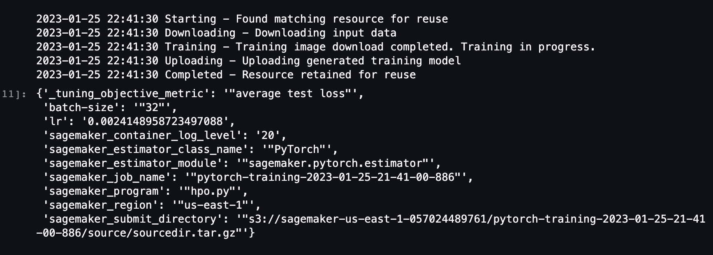
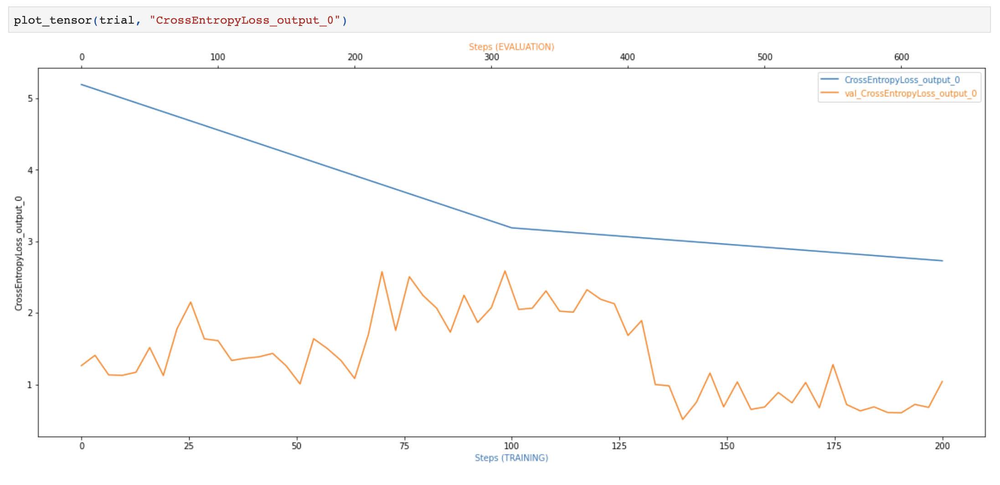

# Image Classification using AWS SageMaker

Use AWS Sagemaker to train a pretrained model that can perform image classification by using the Sagemaker profiling, debugger, hyperparameter tuning and other good ML engineering practices. This can be done on either the provided dog breed classication data set or one of your choice.

## Project Set Up and Installation
Enter AWS through the gateway in the course and open SageMaker Studio. 
Download the starter files.
Download/Make the dataset available. 

## Dataset
The provided dataset is the dogbreed classification dataset which can be found in the classroom.
The project is designed to be dataset independent so if there is a dataset that is more interesting or relevant to your work, you are welcome to use it to complete the project.

### Access
Upload the data to an S3 bucket through the AWS Gateway so that SageMaker has access to the data. 


Remember that your README should:
- Include a screenshot of completed training jobs
- Logs metrics during the training process
- Tune at least two hyperparameters
- Retrieve the best best hyperparameters from all your training jobs


## Hyperparameter Tuning

ResNet18, which is widely used in computer vision tasks, was chosen for this project. As it uses residual connections which bypasses information around the network, it is not prone to vanishing gradients and is known for better performance and faster convergence.

It was also chosen due to its computational efficiency, considering that the budget for this project is quite limited. 

With the need to be conservative in terms of memory and running expenses, the 2 hyperparameters, learning rate and batch size were chosen.

Learning rate has the potential to decrease the losses caused by a faster gradient descent. A learning rate that is too slow, however, can lead to the possibility of not reaching convergence.

Varying the batch size, on the other hand, may help with the non-uniform distribution of images for each class, however, may lead to poor generalization.

The ranges were chosen taking the details mentioned above into account, while considering time and limitations budget. 

Taking into account the batch sizes used for the training and that there are a total of 6683 images in my training data, it was necessary to run the training using parallel jobs. As epochs were not added to the hyperparameters to be tuned, the hyperparameter tuning instances consisted of multiple training jobs. 


**Initial Hyperparameters**

```python
hyperparameter_ranges = {
        "lr" : ContinuousParameter(0.001,0.1),
        "batch-size" : CategoricalParameter([32,64,128])
}
```




## Debugging and Profiling
**TODO**: Give an overview of how you performed model debugging and profiling in Sagemaker

The initial cross entropy loss for training and testing shows that there is a sudden increase in the evaluation plot which suggests overfitting. 

**Initial Ouput


### Results
**TODO**: What are the results/insights did you get by profiling/debugging your model?

**TODO** Remember to provide the profiler html/pdf file in your submission.


## Model Deployment
**TODO**: Give an overview of the deployed model and instructions on how to query the endpoint with a sample input.

**TODO** Remember to provide a screenshot of the deployed active endpoint in Sagemaker.

## Standout Suggestions
**TODO (Optional):** This is where you can provide information about any standout suggestions that you have attempted.
